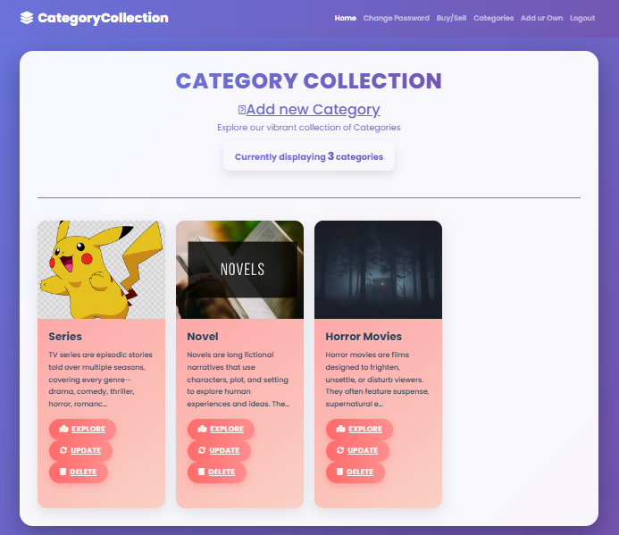
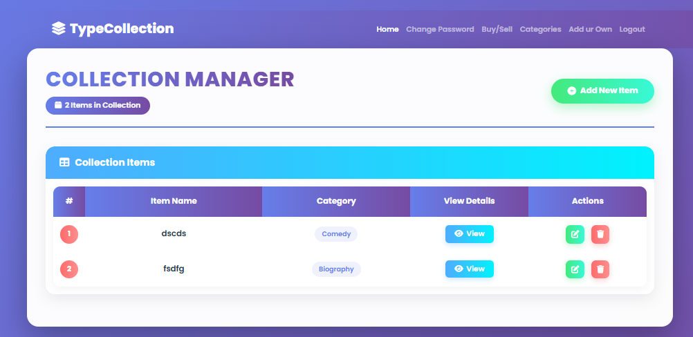
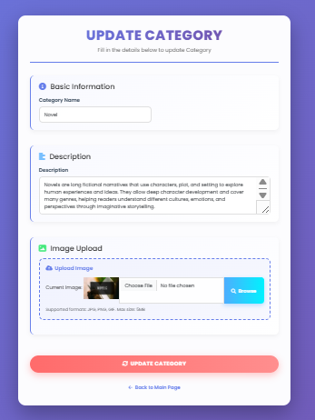
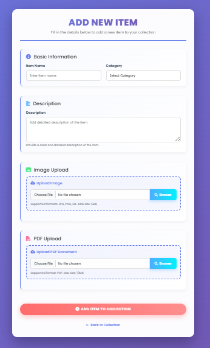
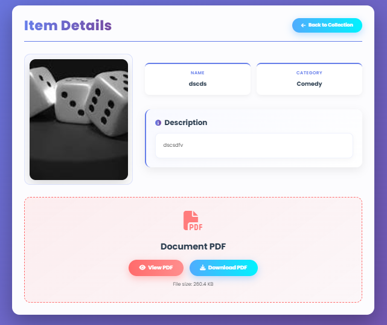

# Reading and Writing Content Management System

## Overview

A Django-based content management system that enables users to manage books, series, and user-generated stories. The platform supports content organization, PDF story uploads, metadata management, and structured relationships between books and series.

## Features

- Book and series management
- User-written story publishing
- Secure PDF file uploads
- Full CRUD (Create, Read, Update, Delete) functionality
- Rich text descriptions and metadata storage
- Relational links between books and series
- Media file handling and validation
- User authentication and access control
- Organized content browsing and management
  
## Technical Highlights

- Designed Django models to manage books, series, categories, and user-written stories
- Implemented complete CRUD functionality for content management
- Enabled secure PDF uploads for user-submitted stories
- Built relational database models connecting books and series
- Managed media storage and file validation
- Developed authentication and authorization mechanisms
- Utilized Django ORM for efficient database operations
  
## Tech Stack

- Python
- Django
- PostgreSQL / SQLite
- HTML
- CSS
  
## Installation

git clone <repository-url>

cd Reading-and-Writing-content-management-system

pip install -r requirements.txt

python manage.py migrate

python manage.py runserver

## Screenshots

### Dashboard

  

### Book / Series Collection List Page

  

### Book / Series Collection Upload Page

  

### Story Upload Page

  

### Book / Series Detail Page

  

### Download Story Page

  

## Author

### Pooja
